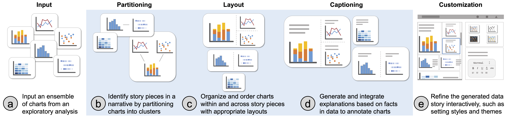

# ChartStory
ChartStory is a visual analysis tool for automated partitioning, layout, and captioning of charts into comic-style narratives. ChartStory is contributed by Jian Zhao, Shenyu Xu, Senthil Chandrasegaran, Chris Bryan, Fan Du, Aditi Mishra, Xin Qian, Yiran Li, and Kwan-Liu Ma. 

ChartStory takes an ensemble of user-created charts (a) and automatically generates a data comic (b-d). This is achieved through a back- end pipeline with operations to identify story pieces (b), organize & order story pieces (c), and generate & integrate explanations (d). The user can also interactively edit the captions and layout of the charts, and change the style or appearance of the data comic (e).

## Demo Video

(click the image to watch)

## Generated Datacomics Examples

#### With NLP generated captions
<table>
 <tr>
  <td>
   college data  
   </img>
  </td>
  <td>
   gun data 
   </img>
  </td>
  <td>
   luma data (used in the scenario) 
   </img>
  </td>
 </tr>
</table>
 
#### With bullet-point-style captions
<table>
 <tr>
  <td>
   college data  
   </img>
  </td>
  <td>
   gun data 
   </img>
  </td>
 </tr>
</table>

#### Theme Examples

<table>
	<tr>
		<td>
			dark theme with comic-style charts
			 
			</img>
		</td>
		<td>
			dark theme example 1
			 
			</img>
		</td>
		<td>
			dark theme example 2
			 
			</img>
		</td>
	</tr>
	<tr>
		<td>
			excel theme example 1
			 
			</img>
		</td>
		<td>
			excel theme example 2
			 
			</img>
		</td>
		<td>
			five thirty eight theme example
			 
			</img>
		</td>
	</tr>
	<tr>
		<td>
			ggplot2 theme example
			 
			</img>
		</td>
		<td>
			latimes theme example
			 
			</img>
		</td>
		<td>
			quartz3 theme example 1
			 
			</img>
		</td>
	</tr>
	<tr>
		<td>
			quartz3 theme example 2
			 
			</img>
		</td>
		<td>
			vox theme example
			 
			</img>
		</td>
	</tr>
</table>

## User Study Results

 - [study #1 results (.xlsx)](https://github.com/thomasxu2009/ChartStory/blob/master/user%20study%20results/study1%20results.xlsx)
 - [study #2 results (.xlsx)](https://github.com/thomasxu2009/ChartStory/blob/master/user%20study%20results/study2%20results.xlsx)
 - [study #3 resulting datacomic (.png)](https://github.com/thomasxu2009/ChartStory/blob/master/user%20study%20results/study3%20datacomic.png)

## High-Resolution Paper Figures

 - [Fig. 4 (.pdf)](https://github.com/WatVis/ChartStory/blob/master/paper_figures/Fig%206.pdf)
 - [Fig. 9 (.pdf)](https://github.com/WatVis/ChartStory/blob/master/paper_figures/Fig%209.pdf)

## System Setup and Running

### Prerequisite:

[Node](https://nodejs.org/) and [Python](https://www.python.org/)

### Install: 

    npm install

(Also install the required Python packages by following the README in the folder "rewrite-python-service")

### Start server: 

    npm start

Open the explorer with "http://localhost:8090/"

